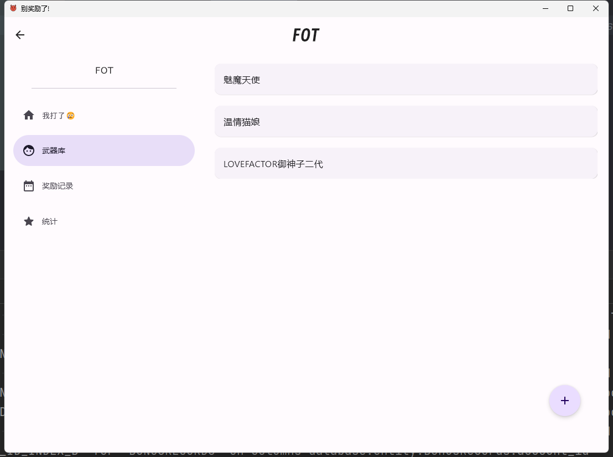
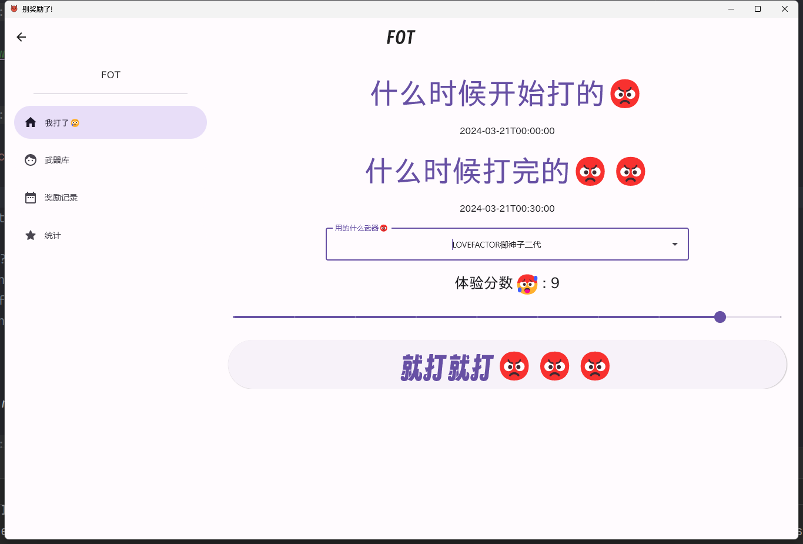
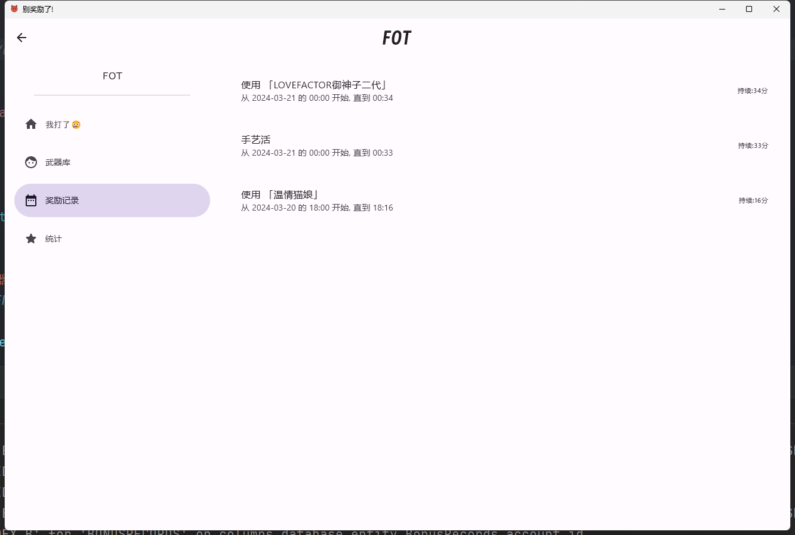
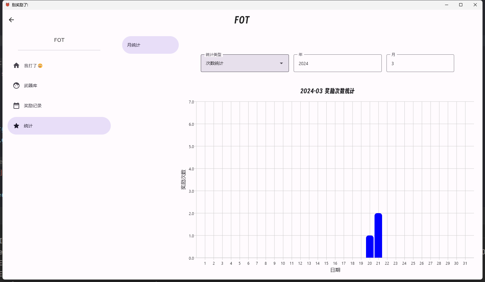
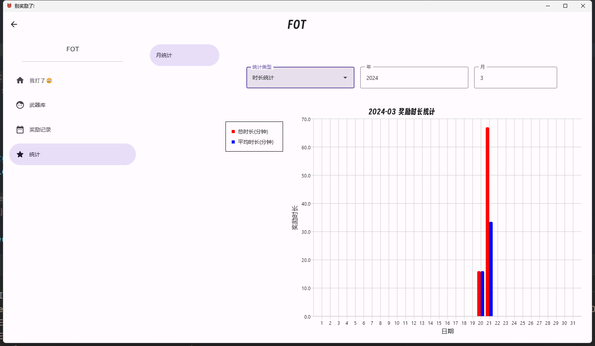

# 别奖励了😡

## 安装

### 下载安装包

前往 [下载页](https://fortescarlet.github.io/StopBonus/download) 下载安装包。

### 从 Release 下载

前往 [latest release](https://github.com/ForteScarlet/StopBonus/releases/latest) 自行选择并下载合适的安装包安装：

- `.zip` 格式的文件为解压**免安装**版本，对于 Windows 用户比较推荐这个类型，目前支持 Windows 系统的和 macOS 系统的。
- 其他的安装包格式请参考自己的系统选择适合的安装包使用。

### 从源码构建

自行拉取源代码后构建应用。

### 

## 使用

**数据保存位置**

Windows 上数据默认储存在 `$USER_HOME\AppData\Local\StopBonus`

**如何使用**

奖励完了填个表。

## 更新

比较建议先卸载旧的，再安装新的。如果数据被保存在安装目录内，记得先备份。
别问，compose打包出来的安装包似乎对更新安装不太友好。

当然，如果实际上是我配置的有问题请务必[告诉我](https://github.com/ForteScarlet/StopBonus/issues/new)，
非常感谢！

## 截图

